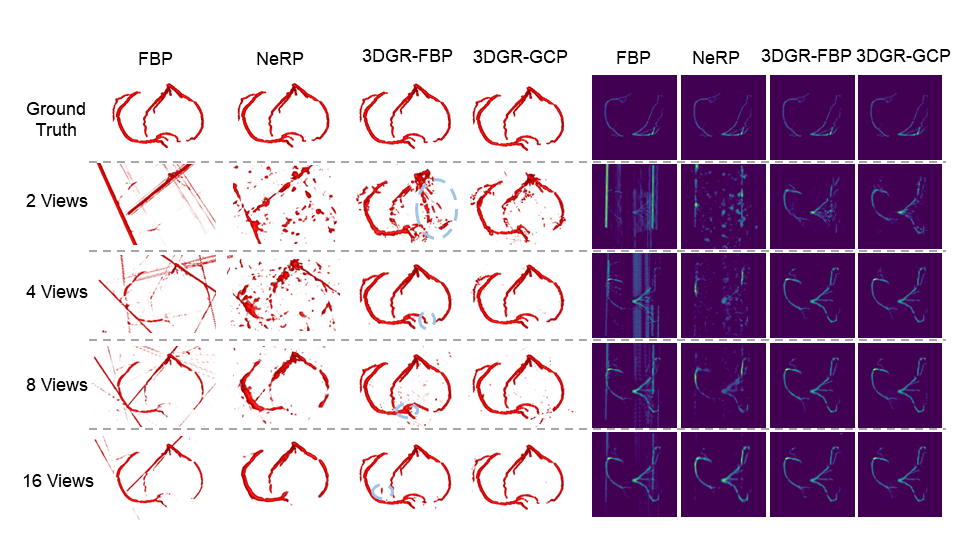
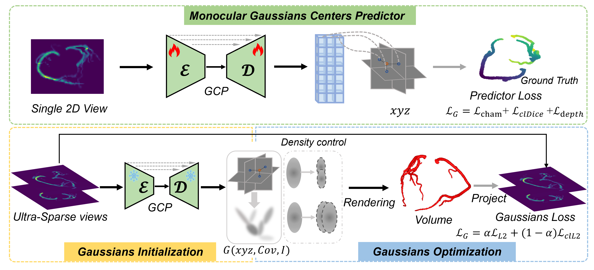
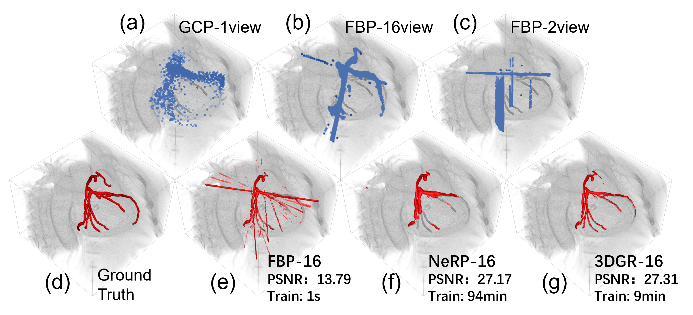

<div align="center">
<h1>3DGR-CAR: Coronary artery reconstruction from ultra-sparse 2D X-ray views with a 3D Gaussians representation</h1>
<h3> Accepted at MICCAI 2024 </h3>

Authors: Xueming Fu, Yingtai Li, Fenghe Tang, Jun Li, Mingyue Zhao, Gao-Jun Teng and S. Kevin Zhou


[](https://arxiv.org/abs/2410.00404)
[](LICENSE)
[](https://github.com/windrise)


</div>

<p align="center">

</p>


## Abstract
Reconstructing 3D coronary arteries is important for coronary artery disease diagnosis, treatment planning and operation navigation. Traditional reconstruction techniques often require many projections, while reconstruction from sparse-view X-ray projections is a potential way of reducing radiation dose. However, the extreme sparsity of coronary arteries in a 3D volume and ultra-limited number of projections pose significant challenges for efficient and accurate 3D reconstruction. To this end, we propose 3DGR-CAR, a 3D Gaussian Representation for Coronary Artery Reconstruction from ultra-sparse X-ray projections. We leverage 3D Gaussian representation to avoid the inefficiency caused by the extreme sparsity of coronary artery data and propose a Gaussian center predictor to overcome the noisy Gaussian initialization from ultra-sparse view projections. The proposed scheme enables fast and accurate 3D coronary artery reconstruction with only 2 views. Experimental results on two datasets indicate that the proposed approach significantly outperforms other methods in terms of voxel accuracy and visual quality of coronary arteries.

<p align="center">

</p>

## Introduction
**Is it possible to utilize a really sparse number of 2D X-ray views to reconstruct coronary arteries in 3D?**
<p align="center">

</p>


## Demo code

### Cloning the Repository

```
$ git clone --recurse-submodules https://github.com/windrise/3DGR-CAR.git
$ cd 3DGR-CAR
```

```
# it is recommanded to use conda
$ conda create -n 3dgs-car python=3.9
$ conda activate 3dgs-car
  
# install dependencies(you can adjust according to your demand)
# torch 2.0.0 + cuda 11.7
$ pip install torch==2.0.0 torchvision==0.15.1 torchaudio==2.0.1
  
$ pip install -r requirements.txt
$ cd 3dgs-car
$ git clone --recursive https://github.com/graphdeco-inria/diff-gaussian-rasterization.git
$ pip install -e gaussian-splatting/submodules/diff-gaussian-rasterization/
$ pip install -e gaussian-splatting/submodules/simple-knn/
  
  
```

###   Install  [ODL](https://github.com/odlgroup/odl) from source manually.

There may be a conflict with the numpy package here.

```shell
#Clone ODL from git:
$ git clone https://github.com/odlgroup/odl

#Install ODL
$ cd odl
$ pip install [--user] --editable .

#Install ASTRA for X-ray tomography
#https://odlgroup.github.io/odl/getting_started/installing_extensions.html
$ conda install -c astra-toolbox astra-toolbox
```


## Dataset

We use public dataset from [ASOCA](https://asoca.grand-challenge.org/) and [ImageCAS](https://github.com/XiaoweiXu/ImageCAS-A-Large-Scale-Dataset-and-Benchmark-for-Coronary-Artery-Segmentation-based-on-CT). 

## Demo


```python
$ unzip ToyData.zip
# 3D Gaussian Representation from FBP result.
$ python train.py
```


## 🤝Acknowledgement

Our repo is built upon [Gasussian Splatting](https://github.com/graphdeco-inria/gaussian-splatting), [Splat image](https://github.com/szymanowiczs/splatter-image), [NeRP](https://github.com/liyues/NeRP) and [ODL](https://github.com/odlgroup/odl). Thanks to their work.


## Citation
```
@inproceedings{fu20243dgr,
  title={3DGR-CAR: Coronary artery reconstruction from ultra-sparse 2D X-ray views with a 3D Gaussians representation},
  author={Fu, Xueming and Li, Yingtai and Tang, Fenghe and Li, Jun and Zhao, Mingyue and Teng, Gao-Jun and Zhou, S Kevin},
  booktitle={International Conference on Medical Image Computing and Computer-Assisted Intervention},
  pages={14--24},
  year={2024},
  organization={Springer}
}
```
